# XVM-LS ユーザーマニュアル

XVM-LS は、World of Warships (WoWS) の戦闘ログとリプレイを読み取り、戦闘中・戦闘後の情報を見やすく表示する非公式デスクトップアプリです。味方・敵チームの傾向、各プレイヤーの戦績、自分の戦績推移を確認できます。

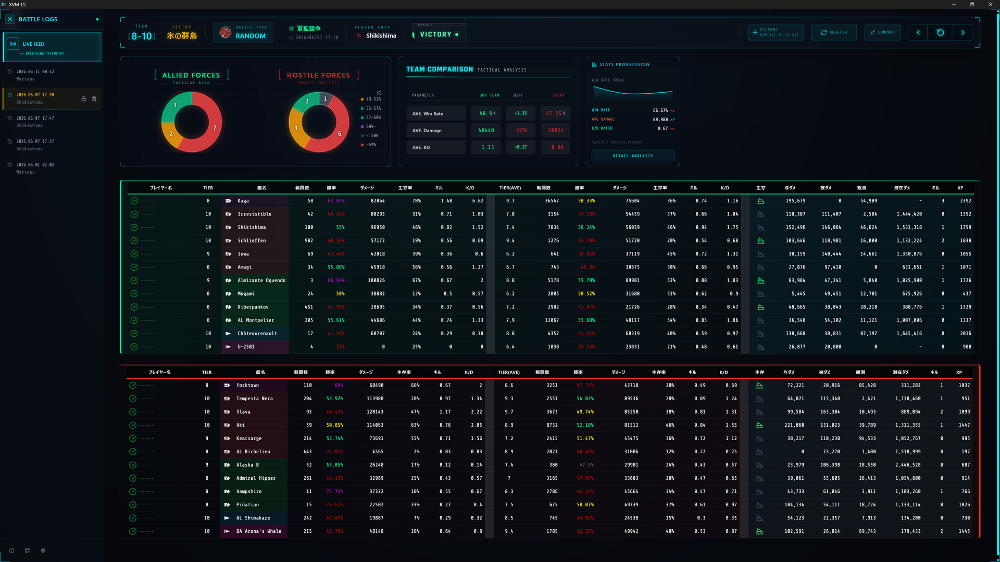
---

## 目次

1. [必要なもの](#必要なもの)
2. [ダウンロード方法](#ダウンロード方法)
3. [初回セットアップ](#初回セットアップ)
4. [基本的な使い方](#基本的な使い方)
5. [画面の見方](#画面の見方)
6. [戦績フィルタ (FILTERS)](#戦績フィルタ-filters)
7. [戦績推移 (Stats Progression)](#戦績推移-stats-progression)
8. [データの管理](#データの管理)
9. [設定](#設定)
10. [バージョン情報](#バージョン情報)
11. [アップデート](#アップデート)
12. [トラブルシューティング](#トラブルシューティング)
13. [注意事項とライセンス](#注意事項とライセンス)

---

## 必要なもの

- World of Warships がインストールされ、リプレイ保存が有効になっていること
- インターネット接続
- Wargaming Application ID

Wargaming Application ID は [Wargaming Developer Portal](https://developers.wargaming.net/) でアプリケーションを作成すると取得できます。

## ダウンロード方法

最新版は [Releases ページ](https://github.com/bamiyan/XVM-LS/releases)で配布しています。

1. Releases ページを開き、最新バージョンの Assets からセットアップ用実行ファイル (`XVM-LS_x.x.x_x64-setup.exe`) をダウンロードします。
2. ダウンロードしたファイルを実行し、インストーラーの指示に従ってインストールします。
3. インストール後に XVM-LS を起動すると、[初回セットアップ](#初回セットアップ)画面が表示されます。

既にインストール済みの環境を新しいバージョンへ更新する場合は、[アップデート](#アップデート)を参照してください。

## 初回セットアップ

初回起動時に「INITIAL SETUP」画面が表示されます。設定内容は後述の[設定](#設定)画面と同じです。

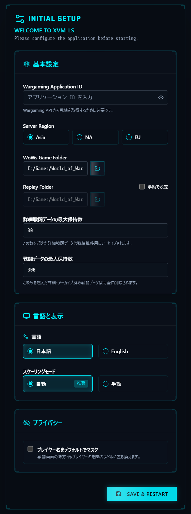

| 項目 | 説明 |
| --- | --- |
| Wargaming Application ID | 戦績取得に使う Wargaming API の Application ID。入力内容は伏せ字で表示され、右端の目のアイコンで表示/非表示を切り替えられます |
| Server Region | 接続先 API リージョン (Asia / NA / EU) |
| WoWs Game Folder | World of Warships のインストール先フォルダ (自動検出されない場合は指定) |
| Replay Folder | リプレイ保存フォルダ。通常は Game Folder から自動設定 (「手動で設定」で個別指定も可) |
| 詳細戦闘データの最大保持数 | 詳細データを保持する件数。超過分は戦績推移用に最小化(アーカイブ)される |
| 戦闘データの最大保持数 | アーカイブ済みを含む総保持件数。超過した古いデータは完全に削除される |
| 言語 / スケーリングモード | 表示言語 (日本語 / English) と表示スケール (自動推奨) |
| プライバシー | [プレイヤー名のマスキング](#設定)を最初から有効にする場合はチェック |

SAVE & RESTART を押すとアプリが再起動し、リプレイフォルダの監視を開始します。

## 基本的な使い方

1. XVM-LS を起動します。
2. World of Warships で戦闘を開始します。
3. 戦闘開始が検出されると、参加プレイヤーの戦績が自動で表示されます。
4. 戦闘終了後、リプレイが保存されると与ダメージ・XP などの結果が追加されます。
5. 過去の戦闘は左側の Battle Logs から再表示できます。

まだ戦闘データがない場合は、レーダー風の待機画面が表示されます。WoWS で 1 戦完了するとデータが表示されます。

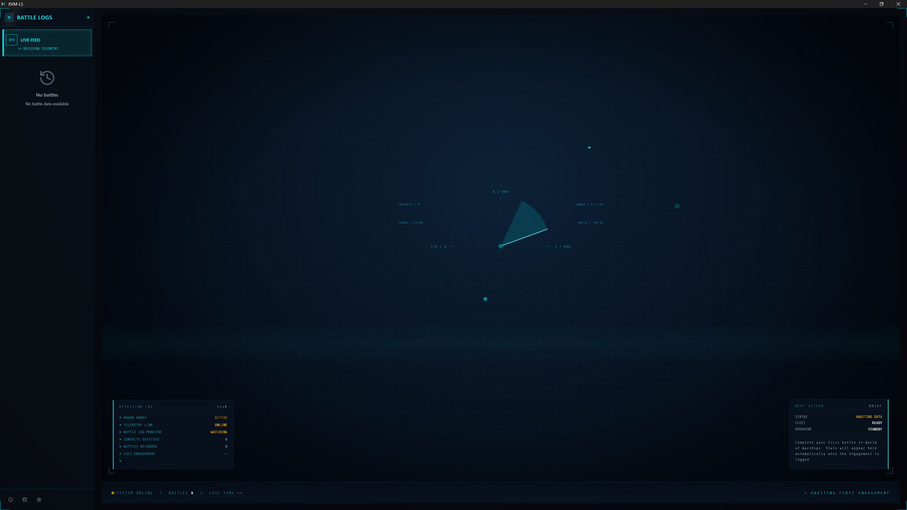

## 画面の見方

### 戦闘ヘッダー

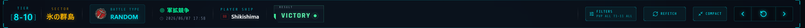

現在表示中の戦闘の概要と操作ボタンです。

| 表示 | 内容 |
| --- | --- |
| TIER | 戦闘のTier帯 (例: 9-11) |
| SECTOR | マップ名 |
| BATTLE TYPE | 戦闘種別 (RANDOM など) とゲームモード (制圧戦など)、戦闘日時 |
| PLAYER SHIP | 自分の使用艦 |
| RESULT | 勝敗 (VICTORY / DEFEAT)。結果未取得の場合は NODATA |

| ボタン | 動作 |
| --- | --- |
| FILTERS | 表示に使う戦績条件を変更 (ボタン下部に現在の条件を要約表示) |
| REFETCH | 最新の戦績を再取得。**保存済みの戦績データは上書きされます** (実行前に確認ダイアログが表示されます) |
| COMPACT / EXPAND | 上部の比較表示をコンパクト/詳細に切り替え |
| ‹ ⌂ › | 前後の戦闘・最新の戦闘へ移動 |

### サイドバー (Battle Logs)

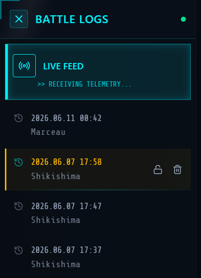

過去の戦闘履歴です。戦闘日時と使用艦が表示され、クリックでその戦闘を再表示します。LIVE FEED を選ぶと最新の戦闘検出に追従します。

各エントリにマウスを乗せると、右側にアイコンが表示されます。

- **鍵アイコン**: 削除・アーカイブからの保護を切り替えます。保護中の戦闘はデータ整理の対象外になります。
- **ゴミ箱アイコン**: 詳細データを削除し、戦績推移用の最小データのみ残します (ARCHIVE)。実行前に確認ダイアログが表示されます。保護中は操作できません。

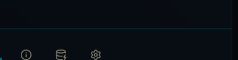

サイドバー下部のボタンは左から、バージョン情報 (About)、[戦闘データの削除](#戦闘データの一括整理)、[設定](#設定)です。

### チーム比較エリア

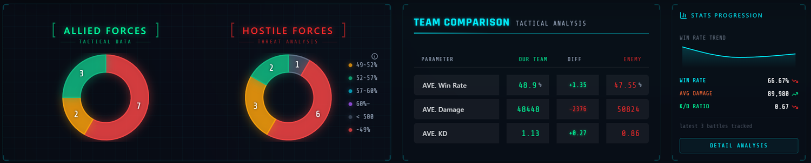

**勝率帯ドーナツチャート (ALLIED FORCES / HOSTILE FORCES)**
チーム内のプレイヤーを勝率帯ごとに色分けし、人数を表示します。

| 区分 | 意味 |
| --- | --- |
| < 500 | 戦闘数500未満または戦績なし |
| ~49% | 勝率49%未満 |
| 49~52% | 勝率49〜52% |
| 52~57% | 勝率52〜57% |
| 57~60% | 勝率57〜60% |
| 60%~ | 勝率60%以上 |

**TEAM COMPARISON**
味方/敵チームの平均勝率 (AVE. Win Rate)、平均ダメージ (AVE. Damage)、平均KD (AVE. KD) を比較し、差分 (DIFF) を表示します。集計は FILTERS の条件に従います。

**STATS PROGRESSION (パネル)**
自分の直近の戦績サマリーです。勝率トレンドのミニチャートと、直近数戦の WIN RATE / AVG DAMAGE / K/D RATIO を表示します。DETAIL ANALYSIS から[詳細分析](#戦績推移-stats-progression)を開けます。

### プレイヤーテーブル

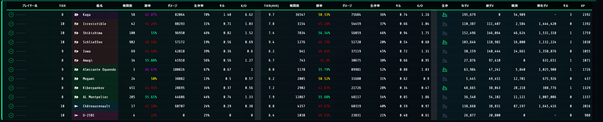

味方 (緑枠)・敵 (赤枠) それぞれのプレイヤー一覧です。列は左から3グループに分かれます。

| グループ | 列 | 内容 |
| --- | --- | --- |
| 基本情報 | プレイヤー名 / TIER / 艦種 / 艦名 | プレイヤー名クリックで WoWS Numbers の該当ページをブラウザで開きます。BOTは「BOT(名前)」と灰色表示。[マスキング](#設定)有効時は全プレイヤーが `------` と表示され、リンクは無効になります |
| 使用艦艇の戦績 | 戦闘数 / 勝率 / ダメージ / 生存率 / キル / K/D | その艦での戦績 |
| プレイヤー総合戦績 | TIER(AVE) / 戦闘数 / 勝率 / ダメージ / 生存率 / キル / K/D | FILTERS の条件に合致する総合戦績 |

- 勝率などの数値は水準に応じて色分けされます (ドーナツチャートと同系統)。
- 戦績非公開・取得不可・条件に合う戦績がないプレイヤーは空欄または `-` になります。

#### 戦闘結果列

戦闘終了後、リプレイ解析が完了するとテーブル右側に結果列が追加されます。プレイヤー名の左に緑のチェックが付いた行は、結果データを取得済みであることを示します。

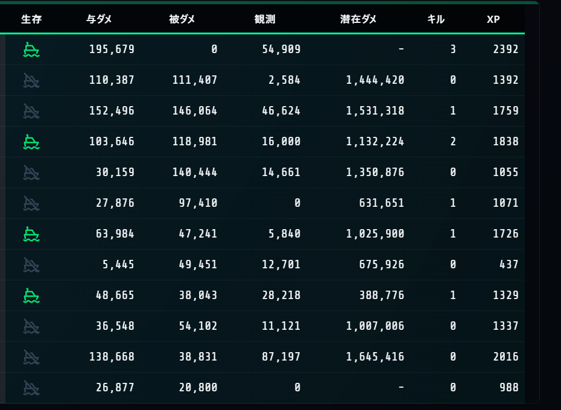

| 列 | 内容 |
| --- | --- |
| 生存 | 船アイコンで生存状態を表示 (緑=生存 / グレー=撃沈)。ホバーで生存時間・沈没理由を表示 |
| 与ダメ | 与ダメージ。ホバーで主砲・魚雷・火災などの内訳を表示 |
| 被ダメ | 被ダメージ。ホバーで内訳を表示 |
| 観測 | 観測 (スポット) ダメージ |
| 潜在ダメ | 潜在ダメージ。ホバーで内訳を表示 |
| キル | 撃沈数。ホバーでその他リボンの内訳を表示 |
| XP | 獲得XP |

### コンパクト表示

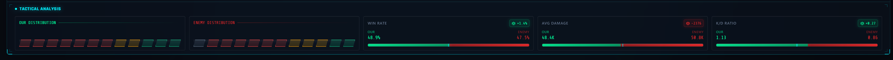

ヘッダーの COMPACT を押すと、上部の比較エリアが1行のバーに収まり、プレイヤーテーブルを広く使えます。バーには両チームの勝率分布 (OUR/ENEMY DISTRIBUTION) と WIN RATE / AVG DAMAGE / K/D RATIO の比較ゲージが表示されます。EXPAND で元に戻ります。

## 戦績フィルタ (FILTERS)

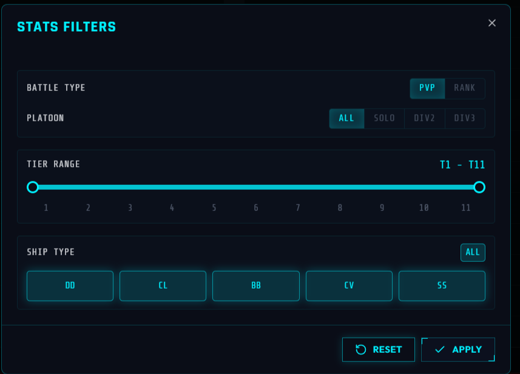

ヘッダーの FILTERS から、プレイヤー総合戦績・チーム比較の集計条件を変更できます。

| 項目 | 選択肢 |
| --- | --- |
| BATTLE TYPE | PVP / RANK |
| PLATOON | ALL / SOLO / DIV2 / DIV3 |
| TIER RANGE | T1〜T11 の範囲指定 (スライダー) |
| SHIP TYPE | DD / CL / BB / CV / SS (ALLで一括選択) |

APPLY で適用、RESET で初期値 (PVP / ALL / T1-T11 / 全艦種) に戻ります。条件を狭くするほど該当戦績のないプレイヤーが増える点に注意してください。

## 戦績推移 (Stats Progression)

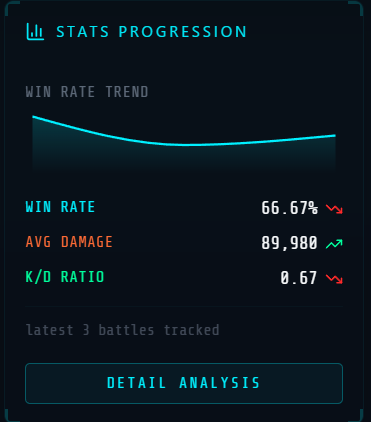

自分の戦績の推移を確認できます。右側パネルの DETAIL ANALYSIS を押すと詳細分析を開きます。

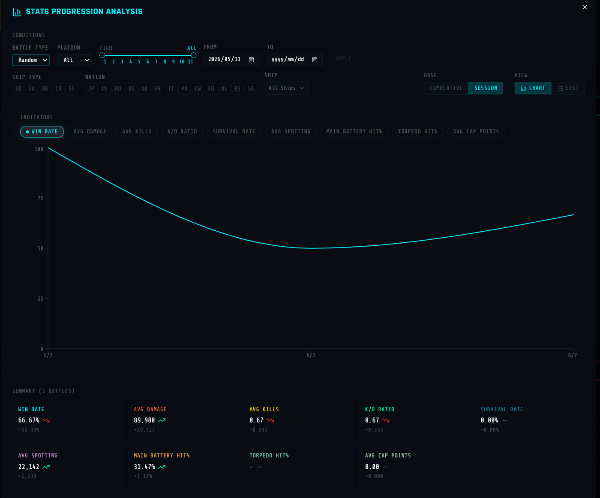

| 設定 | 内容 |
| --- | --- |
| CONDITIONS | BATTLE TYPE / PLATOON / TIER / 期間 (FROM・TO) で絞り込み、APPLY で適用 |
| SHIP TYPE / NATION / SHIP | 艦種・国籍・特定艦で絞り込み |
| INDICATORS | 表示指標: WIN RATE / AVG DAMAGE / AVG KILLS / K/D RATIO / SURVIVAL RATE / AVG SPOTTING / MAIN BATTERY HIT% / TORPEDO HIT% / AVG CAP POINTS |
| BASE | SESSION (セッション単位) / CUMULATIVE (累積) |
| VIEW | CHART (グラフ) / LIST (一覧) |

- 期間の初期値は直近1か月です。該当データがない場合は NO DATA AVAILABLE と表示されます。
- チャート下部の SUMMARY には、条件に該当する戦闘数と各指標の集計値、直近の増減が表示されます。
- LIST 表示では行から該当戦闘へ移動できます。アーカイブ済みの戦闘は推移の計算には使われますが、詳細表示へは移動できない場合があります。

## データの管理

戦闘データは2段階で保持されます。

- **詳細データ**: 画面表示に使う完全なデータ。「詳細戦闘データの最大保持数」を超えた古い戦闘は自動でアーカイブされます。
- **アーカイブ済みデータ**: 戦績推移用の最小データ。「戦闘データの最大保持数」を超えた古いデータは完全に削除されます。

残したい戦闘はサイドバーの**鍵アイコン**で保護してください。保護中の戦闘は自動整理・一括削除の対象外です。

### 戦闘データの一括整理

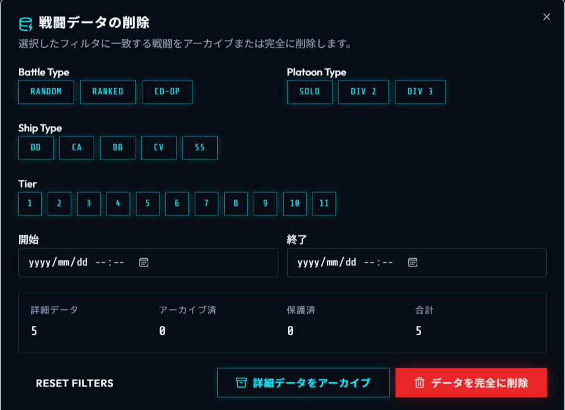

サイドバー下部のデータベースアイコンから開きます。Battle Type / Platoon Type / Ship Type / Tier / 期間で対象を絞り込むと、該当件数 (詳細データ / アーカイブ済 / 保護済 / 合計) がプレビューされます。

| ボタン | 動作 |
| --- | --- |
| 詳細データをアーカイブ | 該当戦闘の詳細データを削除し、戦績推移用の最小データは保持 |
| データを完全に削除 | アーカイブ済みを含め該当データを完全に削除 (保護済みは除外) |

> **完全に削除したデータは復元できません。** 迷う場合は「詳細データをアーカイブ」を使ってください。

## 設定

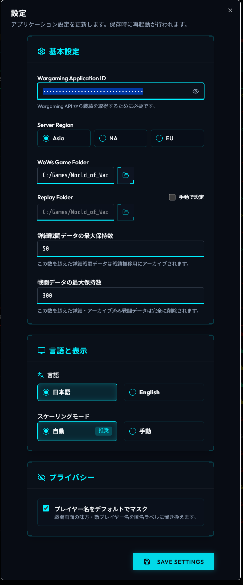

サイドバー下部の歯車アイコンから開きます。項目は[初回セットアップ](#初回セットアップ)と共通です。

| セクション | 項目 |
| --- | --- |
| 基本設定 | Wargaming Application ID (伏せ字表示・目のアイコンで表示切替) / Server Region / WoWs Game Folder / Replay Folder / データ保持件数 |
| 言語と表示 | 言語 (日本語 / English)、スケーリングモード (自動推奨 / 手動 0.5x〜2.0x) |
| プライバシー | プレイヤー名をデフォルトでマスク |

**プレイヤー名をデフォルトでマスク** を有効にすると、戦闘画面の味方・敵プレイヤー名が匿名ラベル `------` に置き換わります。配信や共有用のスクリーンショット撮影に便利です。

Application ID・フォルダ・保持件数などを変更した場合は、保存時にアプリが再起動します。

## バージョン情報

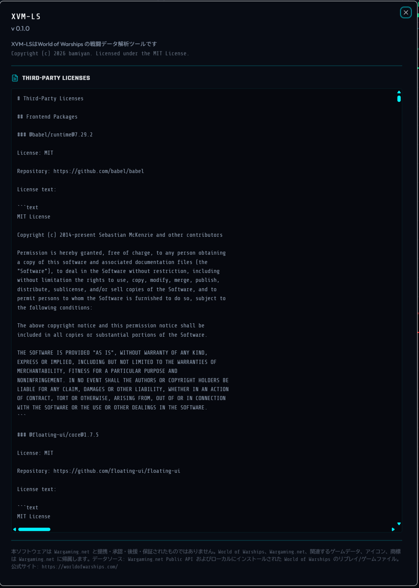

サイドバー下部の情報アイコンから、バージョン、ライセンス、サードパーティライセンス、免責事項を確認できます。

## アップデート

XVM-LS は自動アップデートに対応していません。新しいバージョンへ更新するには、[Releases ページ](https://github.com/bamiyan/XVM-LS/releases)から最新のセットアップ用実行ファイルをダウンロードして実行してください。

インストール済みの環境でセットアップを起動すると、次の選択画面が表示されます。**どちらを選んでもアップデートできます。**

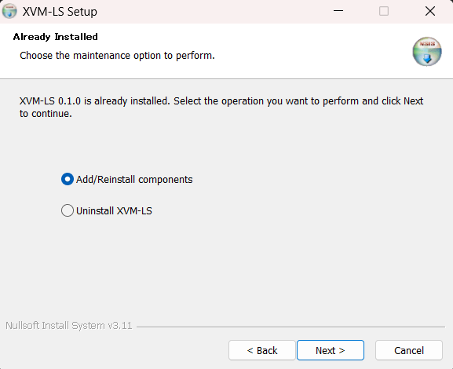

| 選択肢 | 動作 |
| --- | --- |
| Add/Reinstall components | 既存環境に上書きインストールします。通常はこちらを選べば OK です |
| Uninstall XVM-LS | いったんアンインストールしてから、再度インストールします |

> **Uninstall を選ぶ場合の注意**
> アンインストール画面の「Delete the application data」にチェックを入れると、保存済みの戦闘データと設定が**すべて削除**されます。データを引き継いでアップデートしたい場合は、チェックを入れないまま Uninstall を実行してください。

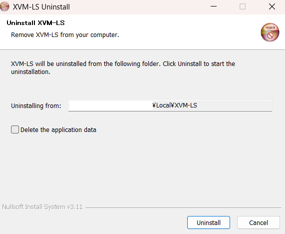

## トラブルシューティング

**戦闘が表示されない**
- WoWS のリプレイ保存が有効か確認してください。
- 設定の WoWs Game Folder / Replay Folder が実際のフォルダを指しているか確認してください。
- XVM-LS を起動した状態で WoWS の戦闘を開始してください。

**戦績が表示されない**
- Wargaming Application ID と Server Region が正しいか確認してください。
- インターネット接続を確認してください。Wargaming API 側で一時的に取得できない場合もあります。
- FILTERS の条件を狭くしすぎていないか確認してください。

**戦闘終了後の結果が追加されない**
- 戦闘終了後に `.wowsreplay` ファイルが保存されているか確認してください。
- 反映まで少し時間がかかる場合があります。

**初期化に失敗する**
- Application ID と各フォルダ設定を確認し、設定し直してからアプリを再起動してください。

## 注意事項とライセンス

- XVM-LS は Wargaming.net と提携していない**非公式アプリ**です。Wargaming.net により承認・後援・保証されたものではありません。
- 表示される戦績は Wargaming Public API とローカルの WoWS リプレイ・ゲームファイルに基づきます。API の仕様、通信状態、プレイヤーの非公開設定、戦闘種別によっては一部データを取得できない場合があります。
- 本アプリは戦術判断の補助を目的としており、勝敗やマッチング結果を保証するものではありません。
- 独自コードは MIT License で公開されています。World of Warships、Wargaming.net および関連するゲームデータ・画像・商標は Wargaming.net の所有物です。
