# XVM-LS

XVM-LS は、World of Warships (WoWS) の戦闘ログとリプレイを読み取り、戦闘中・戦闘後の情報を見やすく表示する非公式デスクトップアプリです。味方・敵チームの傾向、各プレイヤーの戦績、自分の戦績推移を確認できます。

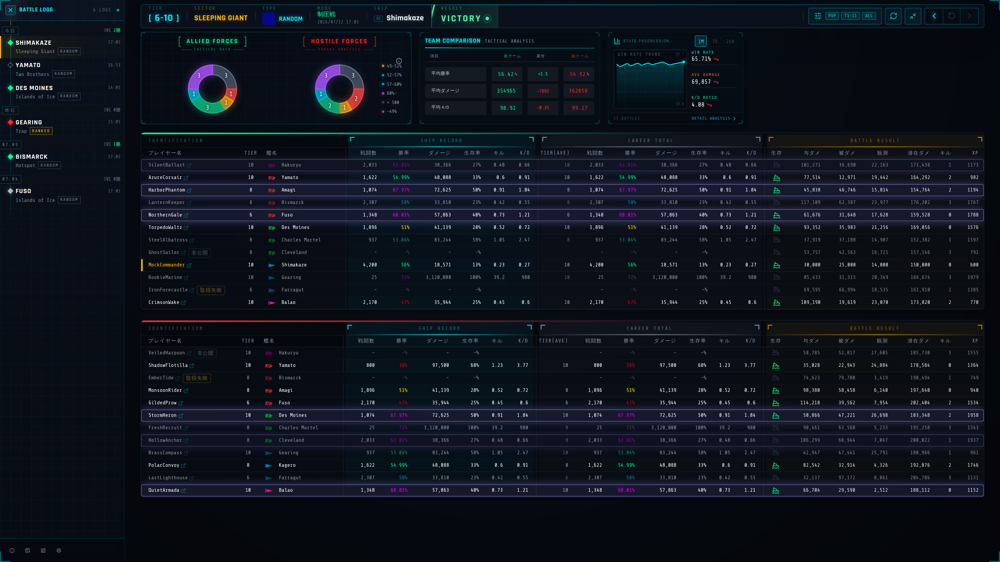

### Quick Tour(Movie)

https://github.com/user-attachments/assets/11d10836-ce43-471b-9e7b-2fd3e6cbbee0

---

## 目次

1. [必要なもの](#必要なもの)
2. [ダウンロード方法](#ダウンロード方法)
3. [初回セットアップ](#初回セットアップ)
4. [基本的な使い方](#基本的な使い方)
5. [画面の見方](#画面の見方)
6. [戦績フィルタ (FILTERS)](#戦績フィルタ-filters)
7. [戦績推移 (Stats Progression)](#戦績推移-stats-progression)
8. [レイアウト編集](#レイアウト編集)
9. [データの管理](#データの管理)
10. [設定](#設定)
11. [バージョン情報](#バージョン情報)
12. [アップデート](#アップデート)
13. [トラブルシューティング](#トラブルシューティング)
14. [注意事項とライセンス](#注意事項とライセンス)

---

## 必要なもの

- World of Warships がインストールされ、リプレイ保存が有効になっていること
- インターネット接続
- Wargaming Application ID

Wargaming Application ID は [Wargaming Developer Portal](https://developers.wargaming.net/) でアプリケーションを作成すると取得できます。

## ダウンロード方法

最新版は [Releases ページ](https://github.com/bamiyan/XVM-LS/releases)で配布しています。

1. Releases ページを開き、最新バージョンの Assets からセットアップ用実行ファイル (`XVM-LS_x.x.x_x64-setup.exe`) をダウンロードします。
2. ダウンロードしたファイルを実行し、インストーラーの指示に従ってインストールします。
3. インストール後に XVM-LS を起動すると、[初回セットアップ](#初回セットアップ)のウィザードが表示されます。

既にインストール済みの環境を新しいバージョンへ更新する場合は、[アップデート](#アップデート)を参照してください。

## 初回セットアップ

初回起動時にフルスクリーンのセットアップウィザードが表示されます。「セットアップを開始」を押し、3 つのフェーズを順に設定してください。

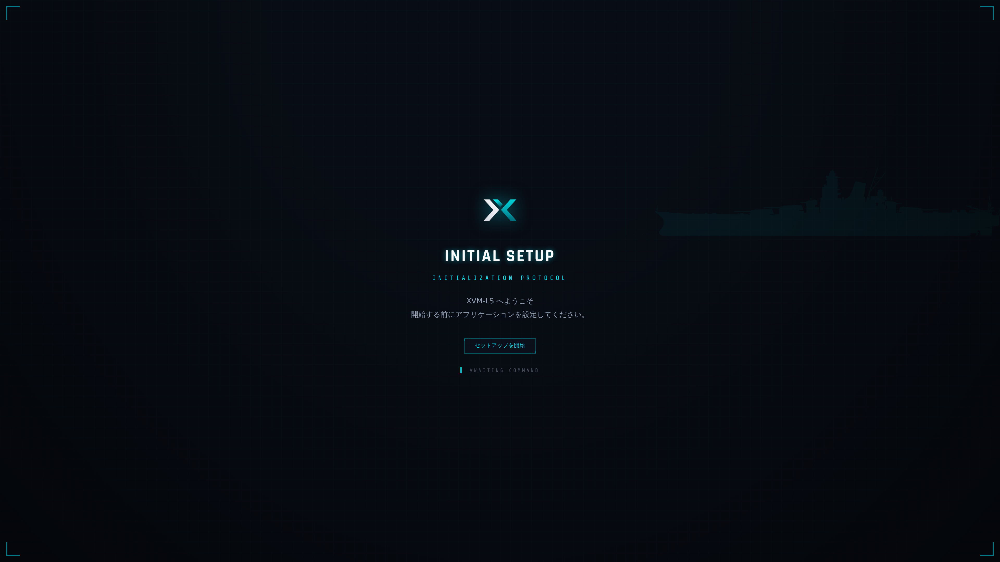

### Phase 01 — API Connection

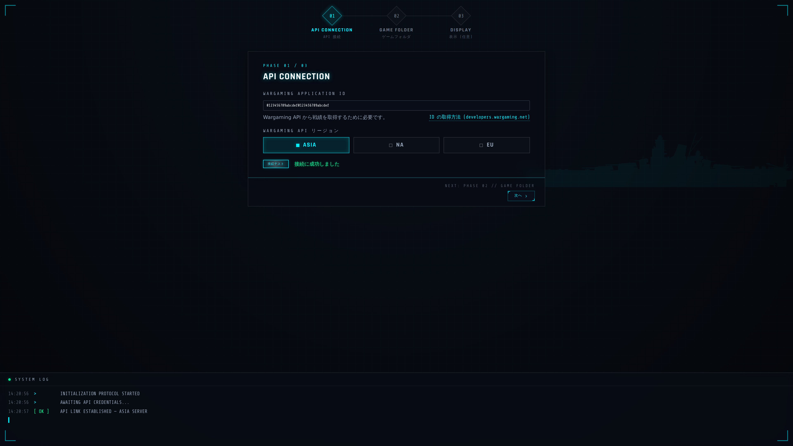

戦績取得に使う Wargaming Application ID を入力し、API リージョン (ASIA / NA / EU) をプレイしているサーバーに合わせて選択します。「ID の取得方法」リンクから Wargaming Developer Portal を開けます。

**接続テストに成功するまで「次へ」には進めません。**

### Phase 02 — Game Folder

World of Warships のインストール先フォルダを指定します。リプレイフォルダは通常、ゲームフォルダ直下の `replays` が自動設定されます。別の場所を使っている場合のみ「手動で設定」で個別に指定してください。

### Phase 03 — Display (任意)

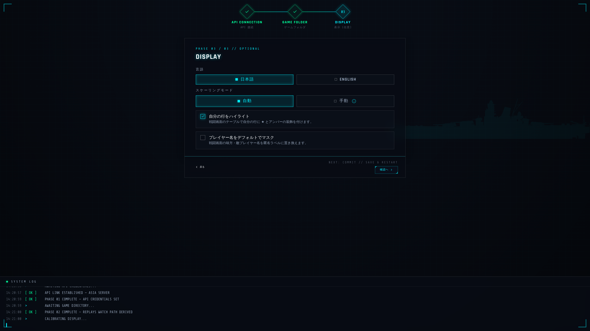

| 項目 | 説明 |
| --- | --- |
| 言語 | 表示言語 (日本語 / English)。選択すると即座に切り替わります |
| スケーリングモード | 表示スケール。自動 (推奨) はモニタ解像度に合わせて調整されます。手動は 0.5x〜2.0x で指定できます |
| 自分の行をハイライト | 戦闘画面のテーブルで自分の行をアンバー色で強調します |
| プレイヤー名をデフォルトでマスク | [プレイヤー名のマスキング](#設定)を最初から有効にします |

最後の確認画面 (ALL SYSTEMS NOMINAL) で **SAVE & RESTART** を押すと設定が保存され、アプリが再起動してリプレイフォルダの監視を開始します。

## 基本的な使い方

1. XVM-LS を起動します。
2. World of Warships で戦闘を開始します。
3. 戦闘開始が検出されると、参加プレイヤーの戦績が自動で表示されます。
4. 戦闘終了後、リプレイが保存されると与ダメージ・XP などの結果が追加されます。
5. 過去の戦闘は左側の Battle Logs から再表示できます。

ウィンドウのサイズ・位置・最大化状態は記憶され、次回起動時に復元されます。

まだ戦闘データがない場合は待機画面が表示されます。WoWS で 1 戦完了するとデータが表示されます。

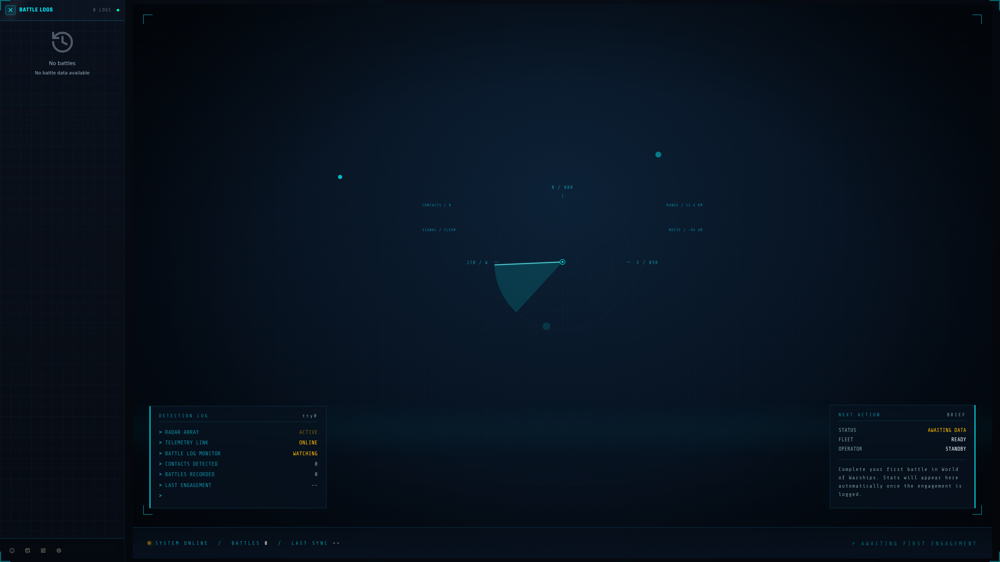

## 画面の見方

### 戦闘ヘッダー

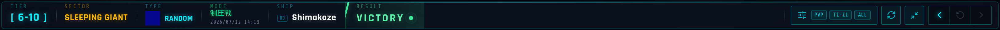

現在表示中の戦闘の概要と操作ボタンです。

| 表示 | 内容 |
| --- | --- |
| TIER | 戦闘のTier帯 (例: 6-10) |
| SECTOR | マップ名 |
| TYPE | 戦闘種別 (RANDOM / RANKED など) |
| MODE | ゲームモード (制圧戦など) と戦闘日時 |
| SHIP | 自分の使用艦 (艦種アイコン付き) |
| RESULT | 勝敗 (VICTORY / DEFEAT / DRAW)。結果未取得の場合は NODATA |

| ボタン | 動作 |
| --- | --- |
| FILTERS (チップ表示) | 表示に使う戦績条件を変更します。ボタン上に現在の条件 (戦闘タイプ / Tier範囲 / 艦種) がチップで表示されます。[AUTOモード](#戦績フィルタ-filters)が有効な項目はアンバー色 + ⟳ 表示になります |
| ⟳ (再取得) | 最新の戦績を再取得します。**保存済みの戦績データは上書きされます** (実行前に確認ダイアログが表示されます)。取得に失敗した場合は部分的に書き換わることはなく、元のデータが保持されます |
| コンパクト切替 | 上部の比較表示をコンパクト/詳細に切り替えます |
| ‹ ⟲ › | 前の戦闘 / 最新の戦闘 / 次の戦闘へ移動します |

### サイドバー (Battle Logs)

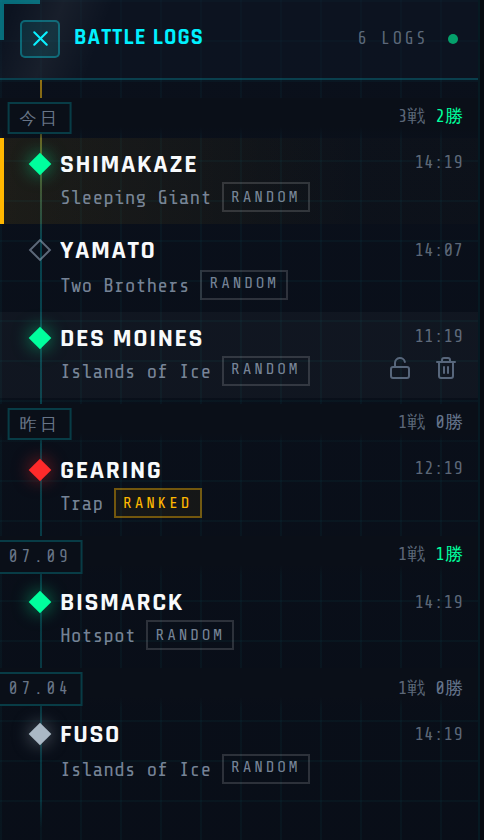

過去の戦闘履歴がタイムライン形式で表示されます。日ごとにグループ化されその日の戦数と勝利数が確認できます。

先頭のダイヤマークは戦闘結果を表します。

| マーク | 意味 |
| --- | --- |
| 緑 | 勝利 |
| 赤 | 敗北 |
| グレー | 引き分け |
| 枠のみ (中抜き) | リザルト待ち (戦闘結果が未取得) |

各エントリにマウスを乗せると、右側にアイコンが表示されます。

- **鍵アイコン**: 削除・アーカイブからの保護を切り替えます。保護中の戦闘はデータ整理の対象外になります。
- **ゴミ箱アイコン**: 詳細データを削除し、戦績推移用の最小データのみ残します (ARCHIVE)。実行前に確認ダイアログが表示されます。保護中は操作できません。

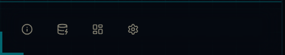

サイドバー下部のボタンは左から、[バージョン情報](#バージョン情報) (About)、[戦闘データ管理](#戦闘データの一括整理)、[レイアウト編集](#レイアウト編集)、[設定](#設定)です。

### チーム比較エリア

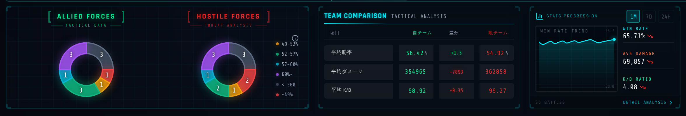

**勝率帯ドーナツチャート (ALLIED FORCES / HOSTILE FORCES)**
チーム内のプレイヤーを勝率帯ごとに色分けし、各セグメントに人数を表示します。

| 区分 | 意味 |
| --- | --- |
| < 500 | 戦闘数500未満または戦績なし |
| ~49% | 勝率49%未満 |
| 49~52% | 勝率49〜52% |
| 52~57% | 勝率52〜57% |
| 57~60% | 勝率57〜60% |
| 60%~ | 勝率60%以上 |

**TEAM COMPARISON**
味方/敵チームの平均勝率・平均ダメージ・平均K/Dを「自チーム / 差分 / 敵チーム」の形式で比較します。集計は FILTERS の条件に従います。

**STATS PROGRESSION (パネル)**
自分の直近の戦績サマリーです。勝率トレンドのミニチャートと WIN RATE / AVG DAMAGE / K/D RATIO、集計対象の戦闘数を表示します。上部の期間タブと DETAIL ANALYSIS については[戦績推移](#戦績推移-stats-progression)を参照してください。

### プレイヤーテーブル

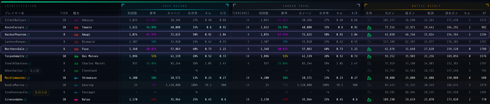

味方 (上端が緑のカード)・敵 (上端が赤のカード) それぞれのプレイヤー一覧です。列は4つのゾーンに分かれ、ゾーンヘッダで区別されます。

| ゾーン | 列 | 内容 |
| --- | --- | --- |
| IDENTIFICATION | プレイヤー名 / TIER / 艦名 | プレイヤー名クリックで WoWS Numbers の該当ページをブラウザで開きます。艦名の左には艦種色のアイコンが付きます。自分の行は名前がアンバー色 + 左端ノッチで強調されます ([設定](#設定)でオフ可)。BOTは灰色表示、[マスキング](#設定)有効時は全プレイヤーが `------` 表示になりリンクは無効になります |
| SHIP RECORD | 戦闘数 / 勝率 / ダメージ / 生存率 / キル / K/D | その艦での戦績 |
| CAREER TOTAL | TIER(AVE) / 戦闘数 / 勝率 / ダメージ / 生存率 / キル / K/D | FILTERS の条件に合致する総合戦績 |
| BATTLE RESULT | 生存 / 与ダメ / 被ダメ / 観測 / 潜在ダメ / キル / XP | 戦闘終了後の[結果列](#戦闘結果列) |

- 列ヘッダのクリックでソートできます (昇順 → 降順 → 解除)。
- 勝率などの数値は水準に応じて色分けされます (ドーナツチャートと同系統)。総合勝率60%以上かつ500戦以上のプレイヤーは行が紫系にハイライトされます。
- 戦績非公開のプレイヤーには「非公開」、取得に失敗したプレイヤーには「取得失敗」のバッジが付き、数値は `-` になります (取得失敗は再取得で回復する場合があります)。

#### 戦闘結果列

戦闘終了後、リプレイ解析が完了するとテーブル右側に BATTLE RESULT ゾーンが追加されます。

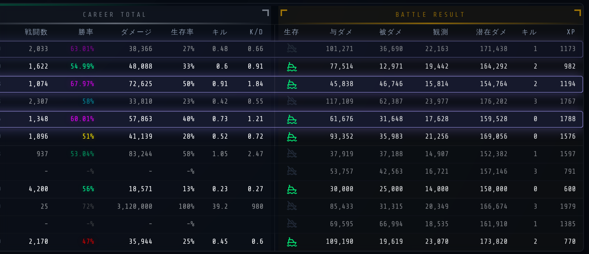

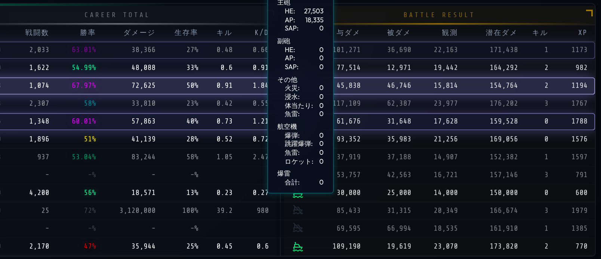

| 列 | 内容 |
| --- | --- |
| 生存 | 船アイコンで生存状態を表示 (緑=生存 / グレー=撃沈)。ホバーで生存時間・沈没理由を表示 |
| 与ダメ | 与ダメージ。ホバーで主砲・魚雷・火災などの内訳を表示 |
| 被ダメ | 被ダメージ。ホバーで内訳を表示 |
| 観測 | 観測 (スポット) ダメージ |
| 潜在ダメ | 潜在ダメージ。ホバーで内訳を表示 |
| キル | 撃沈数。ホバーでその他リボンの内訳を表示 |
| XP | 獲得XP |

撃沈されたプレイヤーの行は全体が減光表示されます。

### コンパクト表示

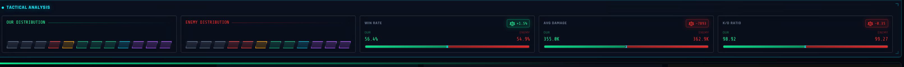

ヘッダーのコンパクト切替ボタンを押すと、上部の比較エリアが1行のバー (TACTICAL ANALYSIS) に収まり、プレイヤーテーブルを広く使えます。バーには両チームの勝率分布 (OUR/ENEMY DISTRIBUTION) と WIN RATE / AVG DAMAGE / K/D RATIO の比較ゲージが表示されます。もう一度押すと元に戻ります。

## 戦績フィルタ (FILTERS)

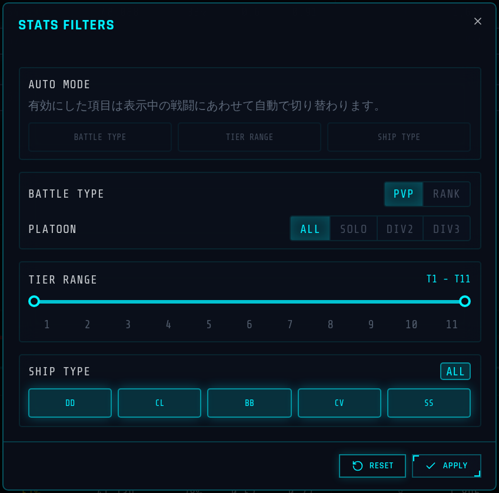

ヘッダーの FILTERS ボタンから、プレイヤー総合戦績・チーム比較の集計条件を変更できます。

| 項目 | 選択肢 |
| --- | --- |
| BATTLE TYPE | PVP / RANK |
| PLATOON | ALL / SOLO / DIV2 / DIV3 |
| TIER RANGE | T1〜T11 の範囲指定 (スライダー) |
| SHIP TYPE | DD / CL / BB / CV / SS (ALLで一括選択) |

APPLY で適用、RESET で初期値 (PVP / ALL / T1-T11 / 全艦種) に戻ります。条件を狭くするほど該当戦績のないプレイヤーが増える点に注意してください。

### AUTO MODE (自動追従)

ダイアログ上部の AUTO MODE では、以下の3項目を「表示中の戦闘」に合わせて自動で切り替えられます。有効にした項目の手動設定は無効化されます。

| 項目 | AUTO時の挙動 |
| --- | --- |
| BATTLE TYPE | 表示中の戦闘がランク戦なら RANK、それ以外は PVP の戦績を表示 |
| TIER RANGE | 表示中の戦闘の Tier 帯に自動で追従 |
| SHIP TYPE | 各プレイヤーが現在使用している艦種の戦績をプレイヤーごとに表示 |

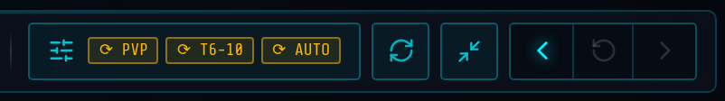

AUTO が有効な項目は、ヘッダーの FILTERS ボタン上のチップがアンバー色 + ⟳ 付きで表示されます (艦種AUTOはプレイヤーごとに異なるため `AUTO` 表示)。

## 戦績推移 (Stats Progression)

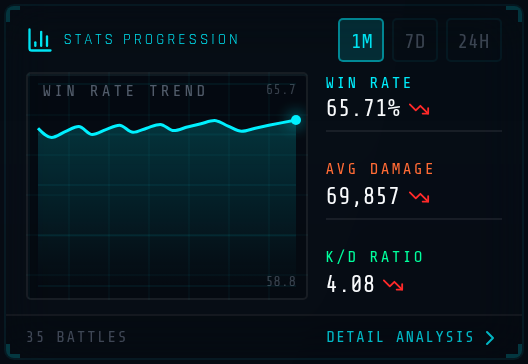

自分の戦績の推移を確認できます。パネル上部の期間タブで集計期間をワンクリックで切り替えられます。

| タブ | 期間 |
| --- | --- |
| 1M | 直近1ヶ月 (初期値) |
| 7D | 直近7日 |
| 24H | 直近24時間 |

タブは押した時点で即適用され、期間以外のフィルタ条件は維持されます。DETAIL ANALYSIS 内で期間を直接変更した場合はカスタム期間扱いとなり、タブは消灯します。

DETAIL ANALYSIS を押すと詳細分析を開きます。

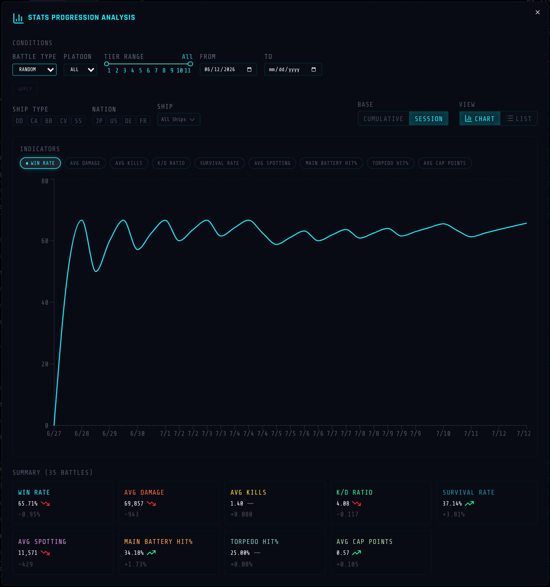

| 設定 | 内容 |
| --- | --- |
| CONDITIONS | BATTLE TYPE (RANDOM / RANKED / CO-OP) / PLATOON / TIER RANGE / 期間 (FROM・TO) で絞り込み、APPLY で適用 |
| SHIP TYPE / NATION / SHIP | 艦種・国籍・特定艦で絞り込み |
| INDICATORS | 表示指標: WIN RATE / AVG DAMAGE / AVG KILLS / K/D RATIO / SURVIVAL RATE / AVG SPOTTING / MAIN BATTERY HIT% / TORPEDO HIT% / AVG CAP POINTS |
| BASE | SESSION (セッション単位) / CUMULATIVE (累積) |
| VIEW | CHART (グラフ) / LIST (一覧) |

- 該当データがない場合は NO DATA AVAILABLE と表示されます。
- 下部の SUMMARY には、条件に該当する戦闘数と各指標の集計値、直近の増減が表示されます。

LIST 表示では戦闘ごとの一覧を確認できます。列ヘッダでソート、下部でページ切り替えができます。# 列がリンク表示になっている行は、クリックでその戦闘の表示へ移動できます (アーカイブ済みの戦闘は推移の計算には使われますが、詳細表示へは移動できない場合があります)。

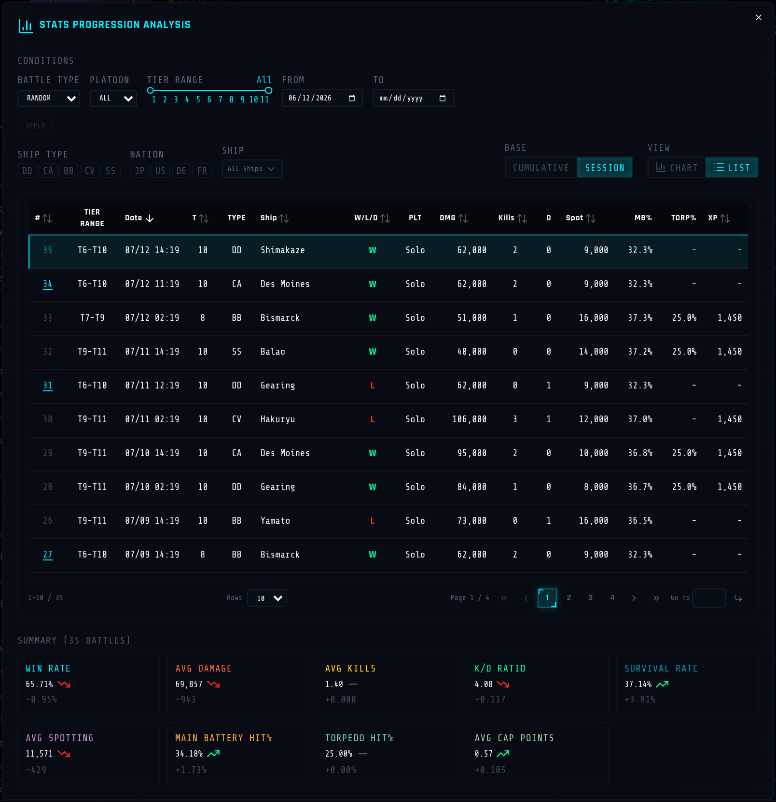

## レイアウト編集

サイドバー下部のレイアウト編集ボタン (定規アイコン) を押すと、メイン画面の各ブロックの表示/非表示をカスタマイズできる編集モードに入ります。

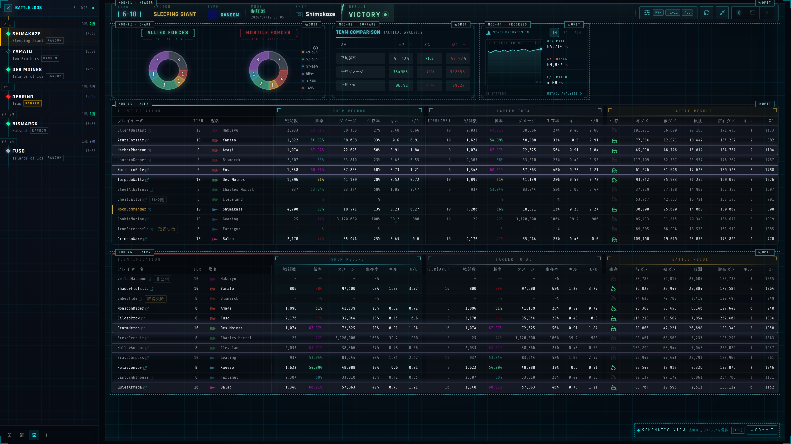

編集モード中は各ブロックが破線フレームと MOD タグ (MOD-01 HEADER など) で表示されます。対象ブロックは次の6つです。

| MOD | ブロック |
| --- | --- |
| 01 HEADER | 戦闘ヘッダー |
| 02 CHART | チーム比較円グラフ |
| 03 COMPARE | チーム比較ボード |
| 04 PROGRESS | 戦績推移パネル |
| 05 ALLY | 味方チーム戦績一覧 |
| 06 ENEMY | 敵チーム戦績一覧 |

- 各ブロック右上の **OMIT** で非表示にします。非表示中のブロックは「MOD-0X · NAME — OMITTED」のプレースホルダに縮退し、**RESTORE** で表示に戻せます。

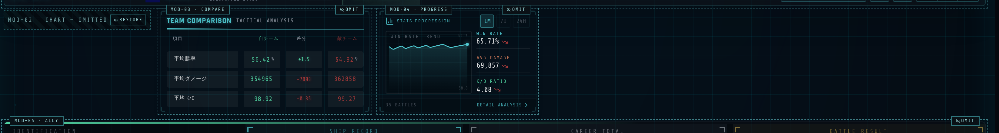

- 右下の **COMMIT** ボタンまたは **ESC** キーで編集モードを終了します (サイドバーのボタン再クリックでも終了できます)。
- 切り替えは即座に保存され、アプリを再起動しても維持されます。
- 通常表示に戻ると、非表示にしたブロックは完全に描画されなくなります。再度表示したい場合は編集モードに入り直して RESTORE してください。
- コンパクト表示とは独立して動作します (コンパクト中は円グラフ・比較ボード・戦績推移がまとめて畳まれます)。

## データの管理

戦闘データは2段階で保持されます。

- **詳細データ**: 画面表示に使う完全なデータ。「詳細戦闘データの最大保持数」を超えた古い戦闘は自動でアーカイブされます。
- **アーカイブ済みデータ**: 戦績推移用の最小データ。「戦闘データの最大保持数」を超えた古いデータは完全に削除されます。

残したい戦闘はサイドバーの**鍵アイコン**で保護してください。保護中の戦闘は自動整理・一括削除の対象外です。

### 戦闘データの一括整理

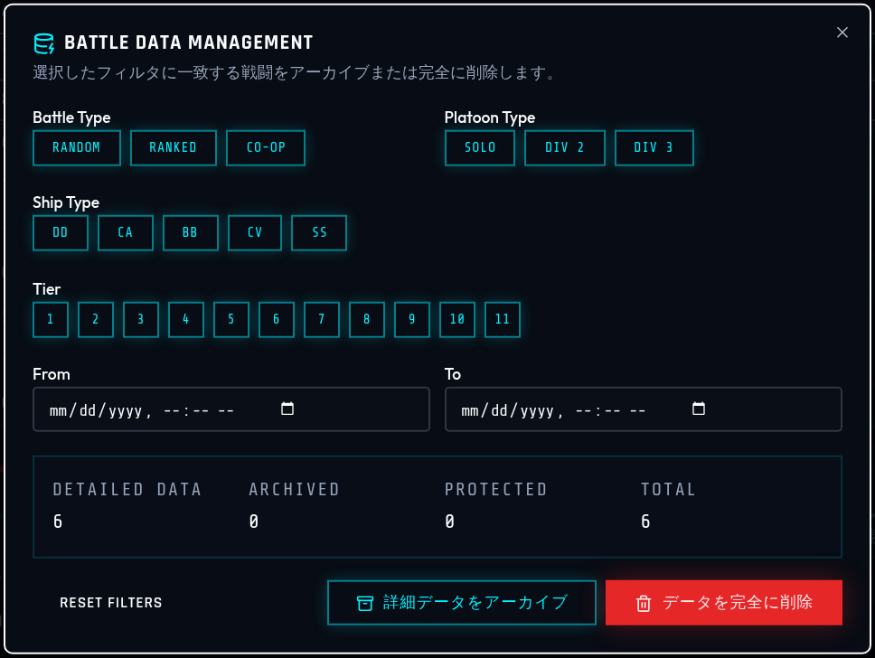

サイドバー下部のデータベースアイコンから「BATTLE DATA MANAGEMENT」を開きます。Battle Type (RANDOM / RANKED / CO-OP) / Platoon Type / Ship Type / Tier / 期間 (From・To) で対象を絞り込むと、該当件数 (Detailed Data / Archived / Protected / Total) がプレビューされます。RESET FILTERS で絞り込みを初期状態に戻せます。

| ボタン | 動作 |
| --- | --- |
| 詳細データをアーカイブ | 該当戦闘の詳細データを削除し、戦績推移用の最小データは保持 |
| データを完全に削除 | アーカイブ済みを含め該当データを完全に削除 (保護済みは除外) |

どちらも実行前に確認ダイアログが表示されます。

> **完全に削除したデータは復元できません。** 迷う場合は「詳細データをアーカイブ」を使ってください。

## 設定

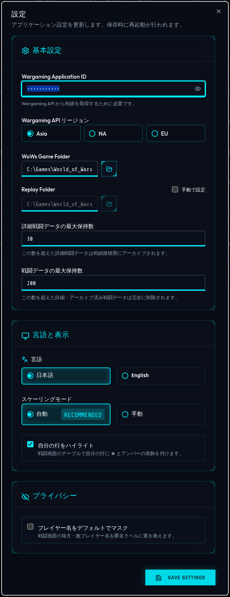

サイドバー下部の歯車アイコンから開きます。

| セクション | 項目 |
| --- | --- |
| 基本設定 | Wargaming Application ID (伏せ字表示・目のアイコンで表示切替) / Wargaming API リージョン (Asia / NA / EU) / WoWs Game Folder / Replay Folder (「手動で設定」で個別指定) / 詳細戦闘データの最大保持数 / 戦闘データの最大保持数 |
| 言語と表示 | 言語 (日本語 / English)、スケーリングモード (自動推奨 / 手動 0.5x〜2.0x)、自分の行をハイライト |
| プライバシー | プレイヤー名をデフォルトでマスク |

**プレイヤー名をデフォルトでマスク** を有効にすると、戦闘画面の味方・敵プレイヤー名が匿名ラベル `------` に置き換わります。配信や共有用のスクリーンショット撮影に便利です。

Application ID・API リージョン・フォルダ・保持件数を変更した場合は、保存時にアプリが再起動します。言語・スケーリング・ハイライト・マスクの変更は即座に反映されます。

## バージョン情報

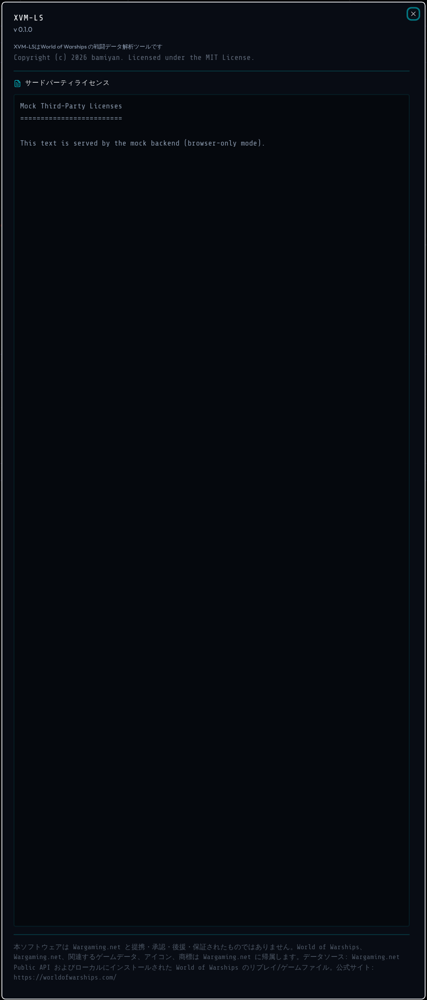

サイドバー下部の情報アイコンから、バージョン、ライセンス、サードパーティライセンス、免責事項を確認できます。

## アップデート

XVM-LS は自動アップデートに対応していません。新しいバージョンへ更新するには、[Releases ページ](https://github.com/bamiyan/XVM-LS/releases)から最新のセットアップ用実行ファイルをダウンロードして実行してください。

インストール済みの環境でセットアップを起動すると、次の選択画面が表示されます。**どちらを選んでもアップデートできます。**

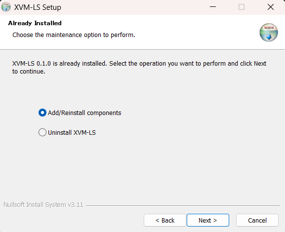

| 選択肢 | 動作 |
| --- | --- |
| Add/Reinstall components | 既存環境に上書きインストールします。通常はこちらを選べば OK です |
| Uninstall XVM-LS | いったんアンインストールしてから、再度インストールします |

> **Uninstall を選ぶ場合の注意**
> アンインストール画面の「Delete the application data」にチェックを入れると、保存済みの戦闘データと設定が**すべて削除**されます。データを引き継いでアップデートしたい場合は、チェックを入れないまま Uninstall を実行してください。

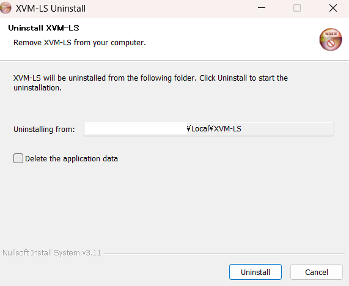

## トラブルシューティング

**戦闘が表示されない**
- WoWS のリプレイ保存が有効か確認してください。
- 設定の WoWs Game Folder / Replay Folder が実際のフォルダを指しているか確認してください。
- XVM-LS を起動した状態で WoWS の戦闘を開始してください。

**戦績が表示されない**
- Wargaming Application ID と API リージョンが正しいか確認してください。
- インターネット接続を確認してください。Wargaming API 側で一時的に取得できない場合もあります。
- FILTERS の条件を狭くしすぎていないか確認してください。

**戦闘終了後の結果が追加されない**
- 戦闘終了後に `.wowsreplay` ファイルが保存されているか確認してください。
- 反映まで少し時間がかかる場合があります。

**「リプレイ監視が停止しました」と表示される**

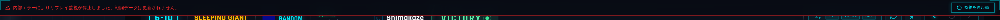

- リプレイ監視が予期せず停止すると、画面上部にバナーが表示されます。「監視を再起動」ボタンで再開できます。
- 繰り返し発生する場合は、アプリを再起動してください。

**設定が初期化された / 設定値が補正されたと通知される**
- 設定ファイルが破損していた場合、アプリは自動で初期設定に戻して起動します。元のファイルは退避されており、通知にバックアップ先のパスが表示されます。
- 不正な設定値が見つかった場合は、安全な値に自動補正されます。

**初期化に失敗する**
- Application ID と各フォルダ設定を確認し、設定し直してからアプリを再起動してください。
- エラー通知に「エラーID」が表示された場合は、問い合わせの際に添えると調査がスムーズです。

## 注意事項とライセンス

- XVM-LS は Wargaming.net と提携していない**非公式アプリ**です。Wargaming.net により承認・後援・保証されたものではありません。
- 表示される戦績は Wargaming Public API とローカルの WoWS リプレイ・ゲームファイルに基づきます。API の仕様、通信状態、プレイヤーの非公開設定、戦闘種別によっては一部データを取得できない場合があります。
- 本アプリは戦術判断の補助を目的としており、勝敗やマッチング結果を保証するものではありません。
- 独自コードは MIT License で公開されています。World of Warships、Wargaming.net および関連するゲームデータ・画像・商標は Wargaming.net の所有物です。
